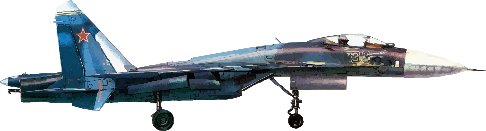

Солнечные лучи ласкали её стальное тело, \
холодный блеск рождал чувство непреступности. \
Когда она двигалась в безграничной пустыне изнуряющего света, \
никто не хотел оказаться на её пути. \
И тем более все страшились её раскрытого капюшона. \
Они боялись боевой стойки «Кобры»! 

