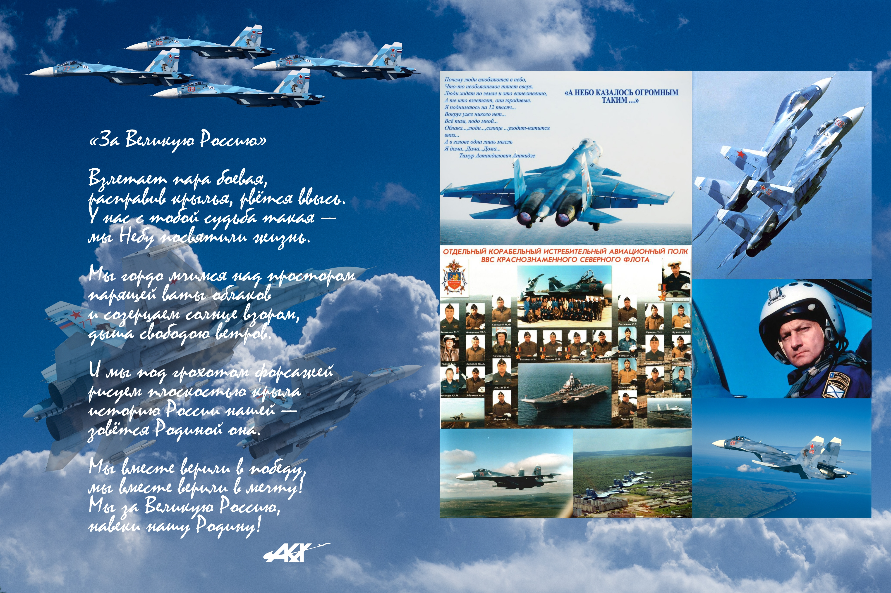
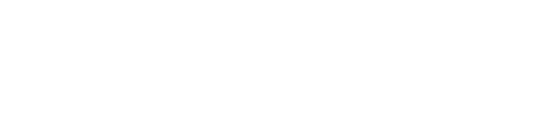

# Записка первая

*Осенний вечер, 15 сентября 2024*

---

Это обычный текст с **жирным** и *курсивным* начертанием.

## Стихотворение

> И если ты уйдешь,  
> Я буду ждать тебя,  
> Как ждут весенний дождь,  
> Как ждут рассвет, любя.

### Формулы

Вот формула Эйнштейна: $E = mc^2$

А вот интеграл:

$$\int_0^\infty e^{-x^2} dx = \frac{\sqrt{\pi}}{2}$$

### Список

- Первый пункт
- Второй пункт
- Третий пункт

### Изображение

  
  
Подпись к изображению

Текст, который будет обтекать изображение слева. Это очень удобно для статей и заметок. Изображение будет плавать слева, а текст будет красиво его огибать. Можно добавить много текста, чтобы увидеть, как работает обтекание. 

Продолжение текста после изображения. Текст будет обтекать изображение до тех пор, пока не закончится или пока мы не вставим другой элемент.

  

А это изображение будет обтекаться справа. Текст будет располагаться слева от него. Очень удобно для создания красивых макетов.

    

---

*© АКХ, 2024* 
